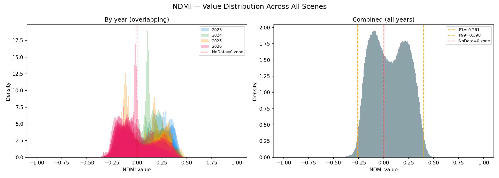
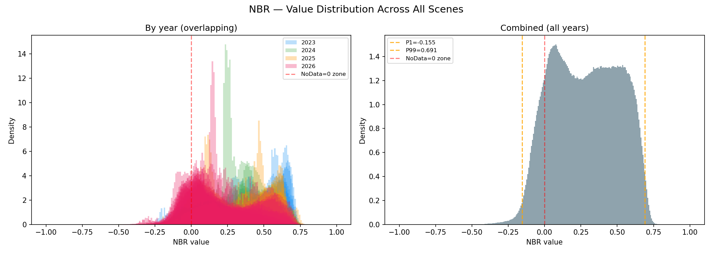
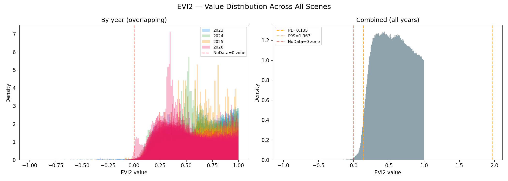
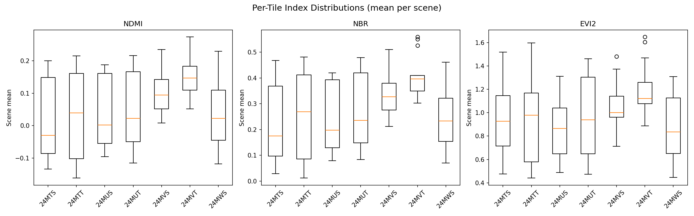

# Araripe Deforestation Monitoring — Data & Code Analysis Report

**Date:** 2026-03-28
**Prepared by:** Claude (automated analysis)

---

## 1. Scientific Background vs. Implementation

### What Was Proposed

The project sketch describes a **zero-cost weekly deforestation alert system** for Chapada do Araripe (7–8°S, 39–40°W), built on:

- **Data**: Sentinel-2 + Landsat via STAC APIs (Element84, Planetary Computer, NASA HLS)
- **Indices**: NDMI (primary), NBR, EVI2, BSI, SAVI — moisture-based indices prioritized over NDVI due to Caatinga deciduousness
- **Baseline**: 12 monthly composites (mean + std) from 3–5 years of history, stored as COGs
- **Detection**: Z-score anomaly detection (z < −2.0) with multi-index confirmation and drought-adjusted thresholds via CHIRPS SPI
- **Pipeline**: Weekly GitHub Actions → Streamlit dashboard on Hugging Face Spaces, COGs served from Cloudflare R2

### What Was Implemented in Code

The repository implements **the complete workflow** as specified. Every module from the sketch exists:

| Component | Sketch | Code | Status |
|-----------|--------|------|--------|
| STAC acquisition (Element84, PC, NASA) | ✅ | `src/acquisition/stac_client.py` | Implemented with fallback chain |
| Cloud masking (SCL, QA_PIXEL, Fmask) | ✅ | `src/processing/cloud_mask.py` | All three sensors supported |
| Indices (NDMI, NBR, EVI2, NDVI, SAVI, BSI) | ✅ | `src/processing/indices.py` | All 6 indices implemented |
| Monthly baseline building (mean + std) | ✅ | `scripts/build_baseline.py` | 5-year lookback, resumable |
| Z-score change detection | ✅ | `src/detection/change_detect.py` | Multi-index, 3 confidence tiers |
| CHIRPS SPI drought adjustment | ✅ | `src/processing/spi.py`, `src/acquisition/chirps.py` | SPI-3, threshold widening |
| Alert vectorization (≥1 ha) | ✅ | `src/detection/alerts.py` | GeoJSON output |
| Time series & trends | ✅ | `src/timeseries/` | Mann-Kendall, STL, BFAST-like |
| Streamlit dashboard | ✅ | `app.py`, `src/visualization/` | Leafmap, Plotly, 4-tab layout |
| GitHub Actions weekly cron | ✅ | `.github/workflows/update_data.yml` | Monday 6:00 UTC |
| Cloudflare R2 upload | ✅ | `scripts/upload_to_r2.py` | S3-compatible |

**Assessment**: The code is a faithful and complete implementation of the proposed architecture. The implementation gap is not in the code but in **execution** — the baseline building script (`build_baseline.py`) stalled at month 7 and never completed.

---

## 2. Downloaded Data Inspection (temp_month_01)

### Overview

Your colleague downloaded **106 GeoTIFF files** totaling **~9.66 GB** for January alone. Assuming similar structure for all 12 months, the full dataset would be approximately **~115 GB**.

### File Naming Convention

```
YYYYMMDD_S[satellite]_[UTM_TILE]_YYYYMMDD_[REVISIT]_L2A.tif
```

Example: `20230103_S2B_24MTS_20230103_0_L2A.tif`

- **Satellite**: S2A (40 files), S2B (40 files), S2C (26 files)
- **UTM Tiles**: 7 tiles covering the AOI — 24MTS, 24MTT, 24MUS, 24MUT, 24MVS, 24MVT, 24MWS
- **Processing Level**: All L2A (atmospherically corrected)
- **Temporal Coverage**: January across 4 years — 2023 (22), 2024 (30), 2025 (16), 2026 (38)

### Band Content

Each file contains **3 bands** (Float32):

| Band | Index | Description |
|------|-------|-------------|
| 0 | NDMI | Normalized Difference Moisture Index |
| 1 | NBR | Normalized Burn Ratio |
| 2 | EVI2 | Enhanced Vegetation Index 2 |

These are the **correct indices** per the project specification (the three primary indices for detection).

### Geospatial Properties

- **CRS**: EPSG:32724 (WGS 84 / UTM zone 24S) — **correct**, matches `config/settings.py`
- **Resolution**: 20 m × 20 m — **correct** for moisture indices (NDMI, NBR use 20 m S2 bands)
- **NoData**: 0

### What Is Good

1. **Correct indices**: NDMI, NBR, EVI2 — exactly what the detection pipeline needs
2. **Correct CRS and resolution**: UTM 24S at 20 m matches the project configuration
3. **Correct processing level**: L2A (surface reflectance)
4. **4 years of January data**: Adequate for baseline building (spec requires 3–5 years)
5. **Per-scene files**: Preserves temporal information for compositing

### What Is Missing or Problematic

#### 1. Files Are NOT Cropped to the AOI
The files cover **full UTM tiles** (up to 110 km × 70 km), not the Chapada do Araripe polygon. The AOI bounding box is [-40, -8, -39, -7] (~111 km × 111 km), so the 7 UTM tiles collectively cover a much larger area. Each file needs to be clipped to the AOI before use.

**Impact**: Not a blocker — the existing `src/acquisition/aoi.py` module has `clip_to_aoi()` functionality that can handle this.

#### 2. Files Are NOT Cloud Optimized GeoTIFFs (COGs)
- No `LAYOUT=COG` tag
- No internal tiling or overviews
- Uncompressed storage (explains the large file sizes)

**Impact**: Cannot be streamed via HTTP range requests. Must be converted before uploading to R2 or serving in the dashboard.

#### 3. Cloud Masking Status — RESOLVED BY VALIDATION
**Cloud masking WAS partially applied.** The validation script (`scripts/validate_baseline_data.py`) analyzed all 106 files and revealed:

- Files use **NaN for masked/no-data pixels** (tile edges + cloud-masked areas), not 0 as the metadata declares
- NaN fractions range from 11% to 90% per scene, averaging ~69% — this includes both tile-edge NaN and cloud-masked NaN
- The high NaN fractions are consistent with pixel-level cloud masking having been applied via the SCL band

**However, residual cloud contamination remains in EVI2** (see Section 3 below).

#### 4. Files Are Per-Scene, Not Composited
The original pipeline (`build_baseline.py`) outputs **2 files per index per month**: `{index}_month{MM}_mean.tif` and `{index}_month{MM}_std.tif`. Your colleague's files are **individual scenes** — they still need to be composited (pixel-wise median/mean and std) to produce the baselines.

**Impact**: Requires an additional processing step, but this is straightforward.

#### 5. NoData Encoding
The file metadata declares `nodata=0`, but the actual no-data encoding is **NaN** (Float32). Very few pixels are exactly 0. This means the NoData=0 concern from initial inspection is **not an issue in practice** — the data correctly uses NaN.

#### 6. No Metadata About Cloud Filtering Criteria
We don't know what cloud cover threshold was used when querying scenes. The original code uses 20% max cloud cover and 10% minimum clear pixels. The high NaN fractions in many scenes (>85%) suggest some heavily cloudy scenes were included.

---

## 3. Validation Results (Histogram Analysis)

The validation script analyzed all 106 January GeoTIFFs. Full outputs are in `scripts/validation_output/`.

### NDMI — PASS



- **Range**: [-0.50, 0.70] — fully within the physical bounds [-1, 1]
- **Mean**: ~0.05 (combined), with 2023 scenes centering ~0.18 and 2026 scenes ~−0.08
- **Distribution**: Unimodal, smooth — **no bimodal cloud contamination signal**
- **Year-to-year variation**: 2025–2026 show lower NDMI than 2023, consistent with drier conditions or different rainfall timing. This is natural inter-annual variability, not a data quality issue
- **Assessment**: Clean. Suitable for baseline compositing

### NBR — PASS



- **Range**: [-0.68, 0.82] — within physical bounds
- **Mean**: ~0.30
- **Distribution**: Unimodal, right-skewed toward vegetated values — **no contamination signal**
- **Assessment**: Clean. Suitable for baseline compositing

### EVI2 — FAIL (residual contamination)



- **Range**: [-0.50, **2.17**] — values above ~1.0 are physically suspect
- **Mean**: ~0.90, with **P99 = 1.97**
- **45.7% of valid pixels fall outside [-1, 1]**, and **48.4% exceed 0.95**
- EVI2 = 2.5 × (NIR − RED) / (NIR + 2.4×RED + 1). The 2.5 multiplier means EVI2 is NOT strictly bounded to [-1, 1], but values above ~1.0 are highly unusual for natural vegetation. Dense wet-season Cerrado typically peaks at 0.5–0.8
- **Likely cause**: Thin cirrus or haze not caught by the SCL cloud mask. Clouds have high NIR relative to RED, which inflates EVI2 far more than NDMI or NBR (which use SWIR bands that clouds absorb)

### Per-Tile Consistency



- NDMI and NBR show consistent distributions across all 7 tiles
- EVI2 shows consistently elevated values across all tiles — confirming this is a systematic issue, not tile-specific
- Tiles 24MVS and 24MVT show slightly higher NDMI/NBR, consistent with the Araripe plateau having denser vegetation (orographic rainfall effect)

### Uncertainties Summary (Updated)

| Question | Status | Finding |
|----------|--------|---------|
| Were clouds masked? | **RESOLVED** | Yes — NaN values confirm pixel-level masking was applied |
| Is cloud masking complete? | **PARTIALLY** | NDMI/NBR clean, but EVI2 shows residual thin-cloud contamination |
| Is NoData=0 causing data loss? | **RESOLVED** | No — actual NoData is NaN, very few pixels are exactly 0 |
| 3-year baseline coverage? | **RESOLVED** | 4 years (2023–2026) available |
| Are all months available? | **LOW** | User confirms similar structure for other months |
| Why does 2025–2026 NDMI trend lower? | **OPEN** | Likely natural inter-annual variability; should cross-check with CHIRPS rainfall data |

---

## 4. Proposal: Path Forward

### Phase 1 — Process Into Baselines

Since NDMI and NBR are validated clean, we can proceed directly to baseline compositing. Write a processing script that:

1. **For each month** (12 months × all years):
   - Load all per-scene files for that month
   - Mosaic tiles covering the AOI into a single raster per date
   - Clip to the AOI polygon (`chapada_araripe.gpkg`)
   - Compute pixel-wise **median** and **std** across all years (median is more robust to outliers than mean)
   - Save as COGs: `{index}_month{MM}_mean.tif` and `{index}_month{MM}_std.tif`

2. **For EVI2 specifically**: Apply an outlier filter — cap values at 1.0 before compositing, or exclude pixels where EVI2 > 1.0 (these are almost certainly cloud-contaminated)

This produces **72 baseline COGs** (3 indices × 12 months × 2 stats) that the detection pipeline expects.

### Phase 2 — Integrate and Test Detection

1. Place baseline COGs in `data/baselines/`
2. Run `scripts/run_detection.py` manually against a known recent Sentinel-2 scene
3. Verify that alerts are generated and GeoJSON output is correct
4. Spot-check alert locations against satellite imagery

### Phase 3 — Operationalize

1. Set up GitHub Actions secrets (STAC API credentials, R2 keys)
2. Enable the weekly cron workflow
3. Deploy the Streamlit dashboard
4. Download CHIRPS data for SPI computation (currently empty: `data/chirps/`)

### Can Your Colleague's Data Be Used?

**Yes.** The downloaded data is usable for the alert system with the following qualifications:

| Index | Usable? | Notes |
|-------|---------|-------|
| NDMI | **Yes — as-is** | Clean distributions, physically valid range, no cloud signal |
| NBR | **Yes — as-is** | Clean distributions, physically valid range |
| EVI2 | **Yes — with filtering** | Cap values at 1.0 or exclude pixels > 1.0 before compositing |

The data has the correct CRS (EPSG:32724), resolution (20 m), and sufficient temporal depth (4 years). The main remaining work is mechanical: tile mosaicking, AOI clipping, temporal compositing, and COG conversion.

---

## 5. Recommendation

**Proceed directly to baseline compositing.** The critical cloud masking question is resolved — NDMI and NBR are clean, and EVI2 can be salvaged with a simple value cap. I can write the compositing script as the next step.
