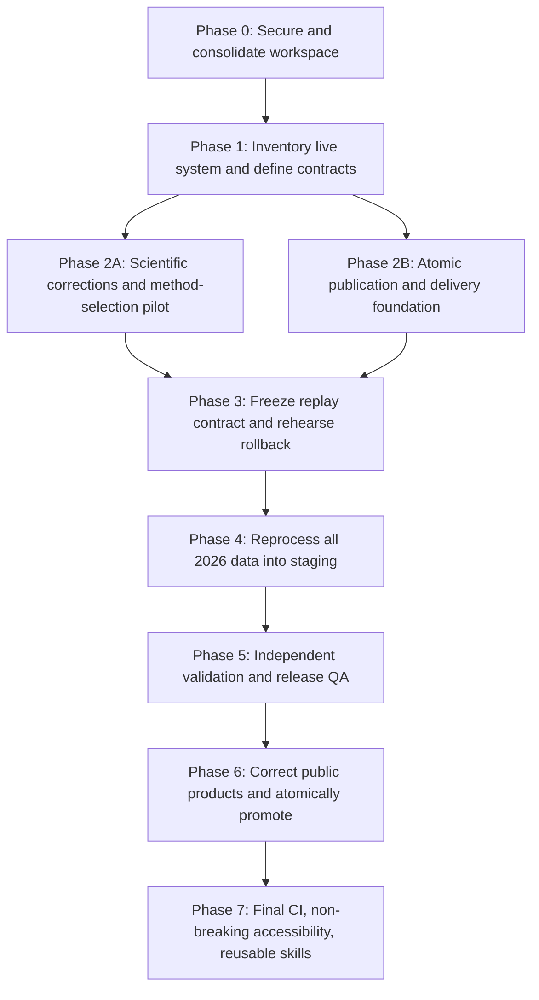

# Technical Remediation Roadmap — Observatório da Chapada do Araripe

**Version:** 1.0
**Decision baseline:** 2026-07-23
**Planning branch:** `codex/technical-review-roadmap`
**Primary evidence:** `TECHNICAL_REVIEW.md` and `TECHNICAL_REVIEW_SUMMARY.md`

---

## 1. Purpose and status

This roadmap consolidates the interactive decisions for Topics 1–34. It is an
implementation plan, not evidence that any correction has already been made.
Except for the review documents, planning branch, and this roadmap, the
scientific pipeline, site, workflows, Cloudflare configuration, R2 objects, and
published products remain unchanged.

The original review grouped the work into 22 topics. Additional security,
scientific, workspace, and agent-configuration decisions expanded the final
ledger to 34 numbered topics, with Topic 21 split into 21A–21C.

### 1.1 Non-negotiable decisions

- Routine monitoring, rainfall, time-series, and public-data publication must
  remain end-to-end automated. They must not require a routine PR, merge, or
  human approval.
- `https://observatoriodachapadadoararipe.com` remains the final public domain.
  Data should preferably be presented through a same-origin route such as
  `/data/...`; an R2 hostname is infrastructure, not the advertised address.
- The monitoring product covers the APA **and its surroundings**. This roadmap
  does not narrow processing to the APA polygon.
- Every release must identify and checksum its actual wider monitoring extent.
  A later scientific review may replace the current implementation-derived
  rectangle, but it cannot be changed silently.
- Raw, scientifically valid detections are retained. MapBiomas may annotate
  them and may help form a validated strong subset, but failing a MapBiomas
  filter must not erase or invalidate a raw detection.
- The present release and 2026 products must be preserved as immutable audit
  and rollback material. “Fresh start” means a new canonical generation, not
  deletion of the old one.
- Critical regression tests accompany the corrections they protect.
  Comprehensive cross-repository CI and branch hardening are deliberately
  scheduled near the end.
- Accessibility work is limited to behavior-preserving improvements. Any
  proposed accessibility change with a material trade-off must be deferred for
  separate approval.
- The backend and site remain independent Git repositories even when placed
  under one common local workspace.

### 1.2 Token-estimate interpretation

Token ranges are planning estimates for analysis, implementation, review,
testing, and handoff. They:

- exclude GitHub, GEE, R2, network-transfer, and local raster-processing time;
- exclude qualified human interpretation time for scientific validation;
- overlap when topics share schemas, tests, workflows, or migration work;
- must not be summed as if every topic were implemented independently;
- should be revised at the start of each execution package after inspecting the
  then-current branches and live configuration.

Intensity bands used below:

| Intensity | Approximate implementation tokens |
|---|---:|
| Low | under 10,000 |
| Medium | 8,000–18,000 |
| High | 15,000–35,000 |
| Very High | 30,000–75,000+ |

---

## 2. Decision ledger

| Topic | Decision | Final scope and constraints | Preliminary estimate |
|---|---|---|---:|
| 1. Public interpretation warning | **Rejected** | No temporary warning because the system is expected to be corrected soon. Reconsider only if correction is materially delayed. | 5k–10k if revived |
| 2. Idempotent persistence | **Approved, modified** | Stable observation keys; duplicate replay is a no-op; tests for retries and overlap. Reduce scheduled lookback from 16 to **5 days**. Backfills use explicit start/end dates. | 15k–25k |
| 3. Restrict processing to the APA polygon | **Rejected** | Surrounding areas are intentionally monitored. The residual task is to formally define, name, version, and document the wider extent. | 8k–15k for residual review |
| 4. Scene-validity guard | **Approved** | Exclude nodata, cloud-masked, and invalid pixels from numerator and denominator; retain the 30% threshold initially; record coverage and rejection reasons. | 8k–15k |
| 5. Fail-safe R2 state loading | **Approved** | Empty state only for an explicit missing object; fail closed on authorization, network, parse, schema, or service failures; never upload replacement state after a failed load. | 10k–18k |
| 6. Serialize workflows and replace timing assumptions | **Approved, modified** | Audit **all workflows in all involved repositories before editing**; use one state-mutating concurrency group; trigger site refresh from release readiness, not a fixed clock delay. | 15k–25k |
| 7. Isolate rainfall from alert publication | **Approved** | Independent jobs/statuses and retries; different freshness timestamps; one product may publish without falsely claiming that the other succeeded. | 8k–14k |
| 8. Atomic, versioned publication and rollback | **Approved** | Immutable release prefixes, validation before promotion, conditional pointer updates, zero-alert representation, retained rollback releases. | 30k–50k |
| 9. Authoritative release manifest | **Approved** | Versioned schema containing commits, workflow runs, algorithms, input checksums, statuses for every date, artifacts, freshness, validation, and rollback metadata. | 18k–30k |
| 10. Production R2 delivery contract | **Approved, access condition satisfied** | Implement through the connected Cloudflare capability; preserve the final public domain; prefer same-origin public URLs; validate CORS, downloads, types, and browser full mode. | 18k–30k |
| 11. Separate public and private R2 storage | **Approved** | Private processing/source/state/baseline storage; public bucket contains only approved release artifacts; staged copy-and-verify migration; no initial deletion. | 30k–50k |
| 12. R2 lifecycle, caching, transfer, and cost controls | **Approved** | Conservative retention; reviewed deletion dry run; changed-object transfers; suitable compression and caching; rollback retention; measured rather than “zero-cost” wording. | 15k–25k |
| 13. Full Cloudflare control-plane audit | **Approved, prerequisite** | Read-only inventory before Topics 8 and 10–12; sanitized configuration map and rollback checklist; verify again after migration. | 8k–15k |
| 14. Remove large generated alerts from site Git | **Approved** | Serve generated products through the release route; retain small schemas/fixtures; prevent reintroduction; no Git-history rewrite without separate approval. | 18k–30k |
| 15. Reproducible Worker/site deployment | **Approved** | Pin Wrangler; codify local/build/deploy/health/rollback commands and non-secret bindings; record source commit/release; reconcile deployment documentation. | 10k–18k |
| 16. Lock dependencies and GitHub Actions | **Approved** | Reconcile Python environments, retain clean Node lockfile installs, pin Actions to reviewed SHAs, test clean environments, and establish update cadence. | 18k–30k |
| 17. PR CI and regression testing | **Approved, final-phase sequencing** | Essential tests ship with each fix. Comprehensive CI, browser suite, branch protection, build-size checks, and deployment checks come near the end. | 25k–45k total; less after embedded tests |
| 18. Stop production bots pushing generated data to `main` | **Approved, modified** | Routine operational publication remains fully automatic through R2. PRs are for code/configuration, not every data refresh. | 8k–16k |
| 19. Secrets, variables, and configuration contract | **Approved** | Inventory and least-privilege scope across repositories, Workers, and R2; step-level exposure; safe preflights; coordinated rotation; unattended operation retained. | 10k–18k |
| 20. Observability, health, and freshness | **Approved, sequenced** | Implement after Topics 8–9; structured release/run logs, summaries, safe health status, post-publication checks, separate freshness clocks, and notifications. | 15k–25k |
| 21A. AI Worker security, privacy, and resilience | **Deferred** | Public-debug removal, provider-safe errors, global timeout, circuit breaker, rate-limit failure handling, provider/privacy notice, and metrics remain future work. | 15k–25k |
| 21B. Browser security hardening | **Deferred** | CSP/report-only rollout, framing and permissions headers, and local-file trail-name DOM injection correction remain future work. | 10k–18k |
| 21C. Accessibility and mobile usability | **Approved, constrained** | Schedule after core science/publication; preserve ordinary mouse, touch, desktop, map, filter, and data behavior; defer changes with trade-offs. | 15k–25k |
| 22. Deterministic historical rebuild | **Approved, expanded** | Reprocess all available 2026 imagery after scientific corrections; explicit date batches; new state from empty chronology; preserve old release; atomic promotion; resume five-day schedule from rebuilt watermark. | 45k–75k plus compute time |
| 23. Independent scientific accuracy assessment | **Approved, modified** | Required desktop-validation pilot of about 60 locations; full sample chosen after pilot; independent imagery/source comparisons and qualified human labels; field checks optional for selected uncertain cases. | 20k–35k pilot; 35k–60k full |
| 24. Baseline and time-series QA | **Approved, prerequisite** | Audit the 72 baseline files first; manifest/checksum/version them; rebuild only if required; quarantine mixed-generation series; add source, coverage, versions, and QA per date. | 15k–25k audit; 30k–50k if rebuilt |
| 25. Drought adjustment | **Approved, conditional activation** | Correct per-date, season-matched, longer-history calculation; never fail silently; compare enabled/disabled; activate only if validation improves results. | 20k–35k |
| 26. Cloud mask and daily composition | **Approved, evidence-selected** | Test accepted SCL classes, cloud/shadow probability, deterministic clearest-pixel/mosaic methods, coverage rejection, and scene provenance; select method from validation. | 20k–35k |
| 27. Versioned MapBiomas 2024 migration | **Approved, revised** | Preserve/checksum national sources; create wider-area crops for Collection 3 beta 10 m 2024 and Collection 10/10.1 30 m 2024; update class mapping; validate the 50% rule; never erase raw alerts. | 25k–40k |
| 28. Fire/mechanical label validation | **Approved** | Replace causal wording with fire-like, exposed-soil/clearing-like, mixed/uncertain, or not-assessed spectral signatures; validate before simplified public use; never affect alert existence/strong membership. | 22k–38k |
| 29. Stable observation and event identities | **Approved** | Deterministic `observation_id` and `event_id`; documented split/merge lineage; persistence carries IDs; distinguish observations, events, and areas. | 24k–40k |
| 30. Public terminology and provenance | **Approved** | Correct confidence/persistence/cause/area language, MapBiomas context, sources, release identity, and freshness; preserve site design and final domain. | 14k–24k |
| 31. Publication completeness gates | **Approved** | Per-date processing ledger; distinguish zero alerts, low coverage, rejection, download failure, missing inputs, and processing failure; incomplete runs never replace the last complete release. | 22k–36k |
| 32. Documentation, attribution, and repository hygiene | **Approved** | Data-source register, licence boundaries, MapBiomas attribution, current domain/method/source metadata, active/legacy/obsolete classification, secret/large-data/generated-document hygiene. | 14k–24k |
| 33. Common workspace and repository consolidation | **Approved, priority prerequisite** | Move `Araripe` under the common parent; retain two independent repositories; inventory/classify other folders; secure credential-looking files first; update paths and verify behavior. | 30k–50k |
| 34. Cross-tool operating contract and staged skills | **Approved, staged** | Shared `AGENTS.md`; `CLAUDE.md` imports it; portable shared skills exposed to both discovery paths; no permanent agent fleet; release/science skills only after workflows stabilize. | 8k–14k contract; 10k–18k per later skill |

---

## 3. Dependency structure

Scientific corrections and publication infrastructure may proceed in separate
bounded branches after Phase 1, but both must pass their gates before the
expensive 2026 replay begins.

---

## 4. Execution roadmap

### Phase 0 — Protect current work and create the common workspace

**Priority:** P0
**Topics:** 33, 34A, early 32
**Estimated intensity:** Very High, approximately 40k–65k

#### 0.1 Secure the planning baseline

- Commit or otherwise back up the technical reviews, PDFs, decision ledger, and
  roadmap before moving the active checkout.
- Record both repository branches, commits, remotes, status, and LFS state.
- Checksum and inventory the untracked national MapBiomas files; do not commit
  them to Git.
- Move the credential-looking files out of the future shared workspace without
  opening or copying their contents into reports.
- Back up or verify the unusually large backend Git object store before any
  cleanup. Do not rewrite history.

#### 0.2 Consolidate the local workspace

- Move the complete backend repository to
  `Observatorio_Chapada_do_Araripe/Araripe`.
- Keep `Araripe/` and `site/` as independent repositories; do not initialize
  Git in the common parent.
- Classify the other folders before moving or removing anything:
  `observatorio_atual` remains an active/legacy data input;
  `design_handoff_observatorio` is a design/content reference;
  `folio-2025-main` is a third-party reference requiring provenance;
  the MP4 is source media.
- Update the site backend-path fallback, documentation, and local tool settings.
- Reopen Codex, Claude Code, editors, terminals, and Git clients at the new
  location.
- Verify both Git repositories, backend imports/tests, site data preparation,
  and production build. Compare generated outputs before accepting the move.

#### 0.3 Establish the cross-tool operating contract

- Add a concise root `AGENTS.md` that maps the workspace and requires the
  executor to read the relevant repository instructions before changing it.
- Add repository-specific versioned `AGENTS.md` files.
- Add `CLAUDE.md` adapters that import the corresponding `AGENTS.md` files
  using `@AGENTS.md`.
- Verify Codex instruction discovery in a fresh session.
- Verify Claude Code discovery with `/context`.
- Keep the instruction files as maps to canonical documentation rather than
  large duplicated manuals.

**Exit gate P0:** The common workspace is safe to open, both repositories retain
their exact state and remotes, all local path-dependent operations work, and
Codex/Claude load consistent instructions.

---

### Phase 1 — Whole-system discovery and contract design

**Priority:** P0
**Topics:** 6 discovery prerequisite, 9 design, 13, 19, 29 design, 31 design,
32 provenance start
**Estimated intensity:** High–Very High, approximately 35k–60k

**Status:** Closed and accepted 2026-07-28; no production mutation performed.

**Evidence package:** `docs/contracts/phase1/README.md` (captured 2026-07-24;
local contract and repository gates revalidated 2026-07-28). The package
includes the refreshed Cloudflare/R2 before-state and the authenticated
names-only GitHub configuration inventory. GitHub cannot expose which
historical Cloudflare access-key ID is stored behind a secret; that ambiguity
is documented and must be replaced by uniquely named, role-specific
credentials before implementation. Connector-limited Cloudflare zone controls
and exact token scope remain mandatory pre-implementation rechecks rather than
evidence that the working plugin is disconnected.

#### 1.1 Cross-repository workflow inventory

Before changing any GitHub Action:

- identify every repository participating in detection, publication, site
  refresh, and deployment;
- read every workflow completely at the current default branch;
- map schedules, manual triggers, permissions, secrets/variables, concurrency,
  generated commits, R2 reads/writes, site deployment, and recovery paths;
- identify the owner of every state mutation and public publication step;
- produce a concise workflow dependency diagram.

#### 1.2 Live Cloudflare and R2 inventory

- Read current buckets, public endpoints, custom domains, CORS, lifecycle,
  routes, Worker bindings, DNS, cache rules, and credential scopes using the
  connected Cloudflare capability.
- Record a sanitized before-state and rollback checklist.
- Reconfirm plugin access immediately before any live implementation.

#### 1.3 Data, identity, and release contracts

Design and version before implementation:

- current wider monitoring-extent identity, geometry/bounds checksum, CRS, and
  area—without narrowing it to the APA;
- `observation_id`, `event_id`, lineage, and persistence observation key;
- processing-ledger statuses for every expected acquisition date;
- release-manifest schema and compatibility policy;
- algorithm, baseline, MapBiomas, schema, and release version identifiers;
- public/private artifact inventory and canonical ownership;
- client migration and cache-invalidation rules.

#### 1.4 Configuration and provenance registers

- Inventory secrets, variables, bindings, credentials, and expected scopes
  without reading values into reports.
- Begin the data-source and attribution register.
- Record exact MapBiomas URLs, access dates, checksums, collection identities,
  native resolution, CRS, NoData behavior, transformations, and redistribution
  terms.

**Exit gate P1:** There is one reviewed map of the workflows/cloud boundary and
versioned draft schemas sufficient for scientific and release implementation.
No production mutation is required to pass this phase.

---

### Phase 2A — Scientific corrections and method-selection pilot

**Priority:** P0 scientific
**Topics:** 2, 4, 23 pilot, 24–29
**Estimated intensity:** Very High, delivered as several resumable packages

#### Package 2A.1 — Persistence, identity, and scene correctness

**Estimate:** High–Very High, 35k–55k

**Implementation status:** Local backend implementation completed 2026-07-28;
focused regressions, accepted Phase 1 contract validation, and the full backend
gate pass. No cloud write, deployment, publication, or historical replay was
performed. See `docs/implementation/PHASE_2A1_2026-07-28.md`.

- Implement stable observation keys and duplicate no-op behavior.
- Reject out-of-order live-state mutation; backfills build a new release.
- Reduce the normal Monday/Thursday lookback to five days.
- Implement deterministic observation/event IDs and lineage rules.
- Correct the finite-valid-pixel scene denominator and record QA reasons.
- Add targeted regression tests for duplicate replay, retry, overlap,
  out-of-order data, splits/merges, invalid pixels, clouds, and nodata.

#### Package 2A.2 — Baseline and time-series audit

**Estimate:** High, 15k–25k audit; Very High, 30k–50k if rebuilding

**Implementation status:** Local/read-only audit completed 2026-07-28. All 72
objects passed checksum, grid, scale, range, and wider-extent coverage gates;
baseline `1.0.0` was accepted without rebuilding. The mixed-generation SQLite
series was preserved and quarantined as a whole, and the future clean-generation
schema was defined. No cloud write, replay, deployment, or publication was
performed. See `docs/implementation/PHASE_2A2_2026-07-28.md`.

- Validate all 72 baseline objects, months, statistics, grids, scale, range,
  wider extent, valid coverage, and checksums.
- Establish an authoritative baseline manifest and reproducible configuration.
- Decide from evidence whether rebuilding is necessary.
- Define the clean 2026 time-series schema and quarantine strategy for
  mixed-generation rows.

#### Package 2A.3 — Validation tooling and method-selection pilot

**Estimate:** High, 20k–35k plus qualified reviewer time

- Build the reproducible sampler and desktop review package.
- Start with approximately 60 balanced locations across confidence, size,
  season, land cover, persistence, and location.
- Include before/after imagery, wider context, time series, independent-source
  comparisons, and structured labels.
- Use the pilot to test review usability and compare alternative scientific
  methods. Do not treat this pilot as the final accuracy estimate.

#### Package 2A.4 — Drought, cloud mask, and daily mosaic

**Estimate:** Very High, 35k–60k with shared validation work

- Compute candidate drought status for each acquisition date using a fixed,
  longer, season-matched rainfall reference.
- Compare detection with and without the corrected drought adjustment.
- Compare SCL/cloud-probability/shadow masks and deterministic same-day
  composition methods.
- Record contributing scenes and valid coverage.
- Lock the final cloud/mosaic method from evidence.
- Activate drought adjustment only if evidence supports it.

#### Package 2A.5 — MapBiomas and contextual cause labels

**Estimate:** Very High, 35k–60k with shared validation work

- Preserve the two national 2024 rasters unchanged outside Git.
- Create and validate versioned regional crops covering the approved wider
  monitoring extent:
  `mapbiomas_col3_beta_10m_2024` as primary detailed context and
  `mapbiomas_col10_1_30m_2024` as a secondary reference/disagreement signal.
- Resolve Collection 3 classes, including natural vegetation, other natural
  cover, anthropic cover, uncertain/mixed, and NoData.
- Compare the current 50% natural-vegetation strong-subset rule with reasonable
  alternatives; do not tune merely to improve totals.
- Preserve every raw detection regardless of MapBiomas strong-subset outcome.
- Replace causal fire/mechanical wording with contextual spectral-signature
  fields and retain within-polygon proportions.

**Exit gate P2A:** The algorithm, baseline decision, five-day incremental
behavior, observation/event identity, cloud/mosaic method, drought activation
decision, MapBiomas mapping/threshold policy, and cause-label policy are frozen
and versioned for the 2026 candidate generation.

---

### Phase 2B — Deterministic, recoverable publication foundation

**Priority:** P0 operational
**Topics:** 5–20, 31; targeted portions of 16–17
**Estimated intensity:** Very High, delivered as several resumable packages

#### Package 2B.1 — State safety and workflow coordination

**Estimate:** High, 25k–40k

- Fail closed when R2 state cannot be authenticated, downloaded, parsed, or
  validated.
- Use a shared concurrency group for every state-mutating scheduled/manual
  detection path, with `cancel-in-progress: false`.
- Replace the fixed backend/site clock offset with a validated release signal.
- Give alerts and rainfall independent execution, retry, and freshness states.

#### Package 2B.2 — Manifest, ledger, atomic publication, and automation

**Estimate:** Very High, 50k–80k

- Implement the versioned release manifest and complete per-date processing
  ledger.
- Publish all artifacts under an immutable release/staging identity.
- Validate schemas, checksums, expected dates, state watermark, and product
  completeness before pointer promotion.
- Use conditional writes so older/racing jobs cannot replace a newer release.
- Keep the last complete release live when a run is partial or fails.
- Represent valid zero-alert dates and stale-object tombstones explicitly.
- Keep operational data publication automatic without PRs or manual merges.

#### Package 2B.3 — R2 separation and production delivery

**Estimate:** Very High, 55k–90k, overlapping Topics 8–12 and 19

- Create a private processing boundary and a public release-only boundary.
- Introduce least-privilege credentials and step-level secret exposure.
- Copy and verify before switching consumers; retain the old paths for
  rollback; do not delete during initial migration.
- Attach the public route to
  `observatoriodachapadadoararipe.com`, preferably under `/data/...`.
- Validate CORS, content types, caching, checksums, downloads, and full-alert
  browser mode.
- Define conservative lifecycle and rollback retention. Run deletion policies
  in reviewed dry-run form first.
- Disable the public internal-bucket path only after full verification.

#### Package 2B.4 — Site artifact, deployment, and dependency migration

**Estimate:** Very High, 35k–60k

- Stop committing large, continuously generated alert archives to site Git.
- Retain small fixtures and schemas for local development and CI.
- Stop bots from pushing routine generated changes directly to protected
  source branches, while keeping R2 updates automatic.
- Pin and script Wrangler deployment/validation/rollback.
- Reconcile and lock the Python/Node environments sufficiently to reproduce
  both the scientific replay and the site deployment.
- Pin GitHub Actions to reviewed commits after the full workflow inventory.

**Exit gate P2B:** A deliberately failed or racing run cannot corrupt canonical
state or expose a partial release; a staged test release can be promoted and
rolled back without a manual data PR.

---

### Phase 3 — Freeze and rehearse the 2026 replay

**Priority:** P0 gate before expensive processing
**Topics:** 8–9, 22, 24–31
**Estimated intensity:** High, 12k–22k

- Choose and record the replay cutoff date. Queue acquisitions after that
  cutoff for later incremental processing.
- Pause state-mutating schedules during cutover or route them to an isolated
  namespace. Do not simply let live state change during the rebuild.
- Snapshot and checksum the current R2 alerts, baseline objects, persistence
  state, SQLite database, site manifest, public products, and both repository
  commits.
- Freeze the wider monitoring extent, algorithm, baseline, cloud/mosaic,
  drought, MapBiomas, label, schema, environment, and release versions.
- Estimate GEE quotas, batch sizes, storage, transfer, and runtime.
- Rehearse staging, failure recovery, pointer rollback, and queued-date
  recovery with a small bounded date range.
- Obtain an explicit pre-cutover review of the runbook and resolved targets.

**Exit gate P3:** The small rehearsal is reproducible, completeness checks pass,
rollback works, and the full replay can run without mutating the live release.

---

### Phase 4 — Reprocess all 2026 data into a candidate release

**Priority:** P0 scientific publication
**Topic:** 22 with inputs from 2, 4, 24–29 and publication controls from 8–9,
31
**Estimated intensity:** Very High, 45k–75k plus GEE/GitHub/local processing
time

1. Preserve the old generation as an immutable historical release.
2. Query every available 2026 acquisition date from January 1 through the
   recorded cutoff using explicit date ranges.
3. Process stateless spectral detection in bounded chronological batches.
4. Record every expected date as complete-with-alerts, complete-zero-alert,
   low-coverage, rejected-quality, download-failed, missing-input, or
   processing-failed.
5. Verify scene IDs, coverage, checksums, and artifacts before accepting each
   batch.
6. Apply versioned MapBiomas annotations and contextual signature fields
   without removing raw detections.
7. Starting from empty state, replay accepted observations once in chronological
   order using stable observation/event IDs.
8. Regenerate persistence tiers, strong subsets, statistics, and clean 2026
   time-series rows.
9. Reconcile the candidate release completely and leave it in staging. Do not
   promote it yet.

**Exit gate P4:** One complete, internally consistent, reproducible 2026
candidate exists in staging with no unresolved date or artifact status.

---

### Phase 5 — Validate the candidate and finalize scientific choices

**Priority:** P0 before validated claims
**Topics:** 23, conditional decisions from 25–28
**Estimated intensity:** Very High, 35k–60k plus human interpretation time

- Draw the full stratified sample from the final candidate population.
- Include an independent known-change sample so recall/omission are measurable;
  reviewing only detected polygons can estimate commission but not omissions.
- Have qualified people label the desktop package. Use multiple reviewers on a
  subset to measure reviewer agreement.
- Treat field visits as optional, targeted follow-up for unresolved cases.
- Estimate precision, recall, commission, omission, important stratum results,
  and uncertainty.
- Decide from evidence whether to activate drought adjustment, which
  cloud/mosaic variant is canonical, which MapBiomas strong-subset policy is
  defensible, and whether public contextual cause labels are reliable enough.
- If a conditional method changes, rerun the affected 2026 stages and repeat
  release QA before promotion.
- Version the sample, labels, calculations, report, and reviewer protocol.

**Exit gate P5:** The final candidate has an approved scientific contract and a
versioned validation report. Any remaining uncertainty is stated explicitly.

---

### Phase 6 — Build the corrected public release and promote it

**Priority:** P0/P1
**Topics:** 10, 20, 30–32; final portions of 8–9, 14–15, 18
**Estimated intensity:** Very High, 35k–60k

- Generate site full, strong, point-index, chart, and download products from
  the staged release manifest—not by independently crawling live prefixes.
- Correct confidence, persistence, event/observation, area, MapBiomas,
  spectral-signature, source, baseline, completeness, and freshness language.
- Display the latest successfully assessed observation separately from the
  latest automation attempt and latest non-empty alert.
- Complete the data-source/attribution register, MapBiomas CC-BY attribution,
  licence boundaries, citation files, README/deployment/method documentation,
  and final public-domain references.
- Add structured run summaries, safe status/health output, product-specific
  freshness monitoring, and post-deployment checks.
- Verify the main domain, same-origin data route, CORS, full/strong modes,
  downloads, rainfall, time series, build, deployment, and rollback target.
- Atomically promote the small release pointer.
- Health-check production, retain the prior pointer for rollback, seed the
  scheduled process from the rebuilt watermark, then process queued post-cutoff
  dates through the five-day incremental contract.

**Exit gate P6:** The corrected release is live on the final domain, all
contracts reconcile, the prior release remains recoverable, and routine
automation continues without a PR or manual merge.

---

### Phase 7 — Final hardening and reusable operations

**Priority:** P1 after core correction
**Topics:** 17, 21C, later 34B–34C
**Estimated intensity:** Very High, approximately 50k–85k

#### 7.1 Comprehensive CI and branch protection

- Add the remaining cross-repository PR checks, browser suite, schema/link/data
  contract checks, build-size guard, accessibility checks, deployment smoke
  tests, and reviewed required-status rules.
- Keep live cloud tests separate from fast deterministic PR checks.
- Protect code branches without introducing manual gates into routine R2 data
  publication.

#### 7.2 Non-breaking accessibility and mobile improvements

- Add semantic controls, keyboard operation, ARIA state, visible focus, reduced
  motion, and responsive improvements.
- Verify visual and interaction equivalence for established desktop,
  mouse/touch, map, filter, and data workflows.
- Defer any item that would materially alter normal behavior.

#### 7.3 Cross-tool reusable skills

- After one successful stable release workflow, create
  `araripe-release-guard`, read-only/dry-run by default.
- After the scientific protocol is accepted and exercised, create
  `araripe-science-qa`.
- Keep one canonical portable `SKILL.md` implementation using the shared Agent
  Skills subset. Expose it through Codex `.agents/skills/` and Claude Code
  `.claude/skills/`; test discovery in both tools.
- Use thin tool-specific adapters only when necessary and add a drift check if
  copies rather than relative links are required.
- Do not create permanent specialist agents. Use temporary, bounded
  scientific, operations, and site-review subagents when parallel read-heavy
  work is useful.

**Exit gate P7:** Critical branches and contracts are guarded, accessibility
improvements preserve ordinary behavior, and stable recurring procedures are
available consistently in both Codex and Claude Code.

---

## 5. Release gates at a glance

| Gate | Required proof |
|---|---|
| P0 — Workspace | Both repositories and data inputs survive the move; paths/tests/build work; secrets are outside the workspace; Codex/Claude instructions agree. |
| P1 — Discovery | All repository workflows, Cloudflare controls, credentials, state owners, schemas, and provenance sources are mapped. |
| P2A — Science | Scientific inputs and conditional methods are versioned and selected through the pilot; targeted tests pass. |
| P2B — Publication | Staging, manifest, completeness, conditional promotion, rollback, public/private storage, and automatic operation work. |
| P3 — Replay readiness | Cutoff, queue, snapshots, environment, batch sizes, failure recovery, and rollback rehearsal are complete. |
| P4 — Candidate | Every expected 2026 date has a terminal status and all candidate artifacts reconcile in staging. |
| P5 — Validation | Independent desktop review and uncertainty report are versioned; conditional methods are resolved. |
| P6 — Canonical release | Main-domain/browser/download/health checks pass; pointer is promoted atomically; previous release remains recoverable. |
| P7 — Hardening | Comprehensive CI, behavior-preserving accessibility, and cross-tool reusable skills are verified. |

---

## 6. Usage-limit strategy

No future prompt should attempt an entire phase at once. Each package should be
implemented in resumable checkpoints:

1. inspect current state and confirm the package boundary;
2. record contracts and acceptance tests;
3. make one coherent change;
4. run proportional local/integration verification;
5. update the implementation log and remaining dependency list;
6. stop at a clean checkpoint before starting another package.

Recommended prompt-sized planning envelopes:

| Work type | Suggested envelope |
|---|---:|
| Read-only audit or contract design | 8k–15k tokens |
| Focused backend/site correction with tests | 12k–25k tokens |
| Cross-repository workflow change | 15k–30k tokens |
| Cloud migration stage with verification | 15k–30k tokens |
| 2026 replay orchestration | Multiple 15k–30k sessions plus external run time |
| Validation tooling/reporting | Multiple 15k–30k sessions plus reviewer time |

With P0 and P1 closed, the next implementation prompt should select exactly
one Phase 2A package. The default starting point is Package 2A.1
(persistence, identity, and scene correctness) because later replay and
publication work depend on its deterministic state behavior.

---

## 7. Deferred and future considerations

These items are recorded so that rejection or deferral does not erase useful
future work. They are not part of the initial approved execution sequence
unless their stated trigger occurs.

### 7.1 Topic 1 — Temporary interpretation warning

**Decision:** Rejected because correction is expected soon.
**Reconsider when:** The corrected canonical release is materially delayed or
the current provisional release will be actively promoted in the meantime.
**Estimate:** 5k–10k.

### 7.2 Topic 3 — Scientifically define the wider monitoring extent

**Decision:** Polygon-only processing was rejected because monitoring the APA
surroundings is important.

The approved roadmap still versions and checksums the current wider footprint.
The future scientific task is to decide whether the implementation-derived
rectangle is the right representation of “APA and surroundings,” then give the
area a formal name, rationale, geometry, version, and public description.

**Reconsider when:** A scientific or policy definition of the surrounding
region becomes available, or before comparing results with another formally
defined monitoring program.
**Estimate:** 8k–15k for design/provenance; much higher if geometry changes
require another historical rerun.

### 7.3 Topic 21A — AI Worker security, privacy, and resilience

**Decision:** Deferred.
**Remaining work:** Remove public provider/debug detail, add a global timeout
and provider budgets/circuit breaker, make rate-limit failures safe, publish a
provider/privacy notice, define prompt-metadata retention, and monitor AI
health without exposing prompts unnecessarily.
**Reconsider when:** The AI assistant becomes a promoted public feature, its
providers change, or abuse/reliability issues appear.
**Estimate:** 15k–25k.

### 7.4 Topic 21B — Browser security hardening

**Decision:** Deferred.
**Remaining work:** Correct the local-file trail-name DOM injection path,
introduce CSP in report-only mode before enforcement, add framing and
permissions protections, and test all legitimate origins.
**Reconsider when:** Frontend security work is scheduled or the affected file
import is promoted. The DOM injection correction is the most concrete item.
**Estimate:** 10k–18k.

### 7.5 Optional field validation

**Decision:** Desktop validation is approved; field visits are optional.
**Reconsider when:** The desktop pilot leaves scientifically important,
accessible, and safe cases unresolved and a qualified local partner is
available.
**Estimate:** External field effort; tooling additions approximately 8k–15k.

### 7.6 Repository names, monorepo conversion, and Git-history rewriting

**Decision:** Excluded from Topic 33.

- Keep GitHub repository names unchanged during stabilization.
- Do not convert the common parent into a monorepo.
- Do not rewrite site history merely to remove old generated artifacts.
- Safe cache/object cleanup may follow a verified backup, but history changes
  need a separate approval and rollback plan.

**Reconsider when:** The corrected system has stable repository ownership,
release automation, and documentation, and a rename/monorepo provides a
demonstrable benefit.
**Estimate:** High to Very High depending on scope.

### 7.7 BFAST structural-break detection

**Status:** Not implemented and not on the remediation critical path.

The existing harmonic residual heuristic must not be presented as BFAST. A real
implementation needs retained per-date history, a trend/seasonal structural
break method, confidence intervals, and a decision between pixel, region, or
parcel scale.

**Reconsider when:** The corrected pipeline retains a sufficiently long and
dense per-date stack and the project has a clear BFAST scientific question.
**Estimate:** Very High.

### 7.8 Sentinel-1 SAR

**Status:** Separate future project.

Wet-season SAR monitoring requires calibration, speckle handling, terrain
correction, and SAR-specific backscatter/coherence detection. It cannot reuse
the optical thresholds as a credential toggle.

**Reconsider when:** Persistent optical gaps remain after cloud/mosaic
correction and there is capacity for a separately validated SAR workflow.
**Estimate:** Very High.

### 7.9 Landsat/HLS per-sensor baselines

**Status:** Partial future capability.

Landsat and HLS may remain optional research inputs, but they should not be
represented as routine production sources or compared canonically against a
Sentinel-2 baseline. Each sensor requires its own baseline and validation.

**Reconsider when:** The project chooses multi-sensor production after the
Sentinel-2 2026 generation is stable.
**Estimate:** Very High.

### 7.10 Independent omission reference

**Status:** Now partly absorbed by approved Topic 23.

Final recall/omission estimates still require an independent known-change
reference population, such as suitable external validated alerts or manually
interpreted/digitized changes not selected from this system’s detections.
MapBiomas land cover is contextual and is not such a reference.

**Required when:** The project wants defensible recall or omission claims, not
only precision/commission estimates.
**Estimate:** Included partly in Topic 23 plus human-reference preparation.

### 7.11 Permanent specialized agents or a project plugin

**Decision:** Do not create them now.

Use concise shared instructions, two eventual reusable skills, and temporary
subagents. Reconsider a read-only release steward only after at least three
stable manual release-guard runs demonstrate a recurring need. Package the
skills as a plugin only if they later need distribution to other people or
workspaces.

---

## 8. Small owner decisions to resolve inside later packages

These choices do not block approval of the roadmap, but the relevant executor
must surface them before implementation:

- exact same-origin public data path under the final domain;
- number and duration of rollback releases;
- notification destination and freshness thresholds;
- 2026 replay cutoff date and maintenance-window timing;
- qualified desktop-validation reviewers and review-agreement subset;
- final sample size after the approximately 60-location pilot;
- whether any validation result justifies optional field follow-up.

No executor should silently choose one of these where it changes public
behavior, retention, scientific interpretation, or production cutover.
