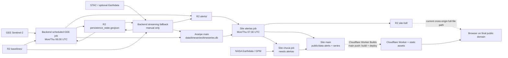

# Phase 1 System Boundary and Workflow Inventory

**Captured:** 2026-07-24
**Cloudflare control-plane refresh:** 2026-07-28
**Scope:** `Araripe`, `observatorio-site`, their GitHub Actions workflows,
Cloudflare R2 data movement, and the intended Cloudflare delivery boundary
**Mode:** Read-only discovery; no workflow, GitHub setting, R2 object,
deployment, DNS, secret, or cloud control was changed

This is the Phase 1.1 before-state required by `ROADMAP.md`. It describes the
system that exists now; it is not approval of the current mutation or
publication model. The backend and site remain independent repositories.

## 1. Evidence and freshness

The actual GitHub default branch is `main` in both repositories. The three
workflow files below were read completely from the GitHub default branch on
2026-07-24 and matched the corresponding local files.

| Repository | Workflow | Verified blob SHA |
|---|---|---|
| `santibravocmcc/Araripe` | `.github/workflows/detect_gee.yml` | `d2a6f9b1b7fa4601ea3ec9fddeecf9b166c63c32` |
| `santibravocmcc/Araripe` | `.github/workflows/update_data.yml` | `20d470840dc04b31842d7596cf12623493f9a06e` |
| `santibravocmcc/observatorio-site` | `.github/workflows/update-data.yml` | `ff663b48ca52afffb78d96a510a69bf12742ff4e` |

Implementation paths inspected for this inventory include:

- backend `scripts/run_detection_gee.py`,
  `scripts/run_detection_from_gee.py`, `scripts/run_detection.py`,
  `scripts/fetch_baselines_from_r2.py`, `scripts/upload_to_r2.py`,
  `scripts/r2_state.py`, `src/detection/persistence.py`,
  `src/timeseries/builder.py`, and `config/settings.py`;
- site `scripts/prepare_data.py`, rainfall preparation scripts,
  `src/js/alertas.js`, `worker/index.js`, `wrangler.jsonc`,
  `public/_headers`, `package.json`, and deployment documentation;
- the dated live evidence in `TECHNICAL_REVIEW.md`.

Cloudflare control-plane access was not available on 2026-07-24. A sanitized
read-only refresh on 2026-07-28 subsequently verified the live deployment,
domain, bindings, R2 boundary, and rollback targets. The dated evidence and
remaining authorization gaps are separated in
`CLOUDFLARE_BEFORE_STATE_AND_ROLLBACK_2026-07-24.md`.

## 2. System boundary

Inside the operational boundary:

- GEE and STAC/NASA sources provide imagery or rainfall inputs;
- backend Actions create source observations, persistence state, and SQLite
  statistics;
- R2 stores baselines, source observations, persistence state, and derived full
  site files in one currently configured bucket namespace;
- site Actions transform source observations and SQLite rows into browser
  assets and update rainfall products;
- Git bot commits carry the backend database and site public assets;
- Cloudflare Worker Builds deploys the Vite build and Worker from site `main`.

Outside this inventory:

- scientific corrections and schema implementation after Phase 1;
- a 2026 replay or promotion;
- creation, migration, deletion, or policy changes in R2;
- live deployment, DNS, custom-domain, token, or secret changes;
- GEE asset publication and one-off baseline rebuilding.

The approved public domain remains
`https://observatoriodachapadadoararipe.com`. The approved direction is a
same-origin public data route such as `/data/...`; the repository still points
full alert retrieval at a cross-origin `r2.dev` development hostname.

## 3. Current dependency flow

The 90-minute schedule offset is a timing assumption, not a release dependency:
the site does not verify a backend run ID, source commit, release manifest,
completeness status, or publication pointer before rebuilding. GitHub schedules
are also best-effort and may start late.

## 4. Workflow inventory

### 4.1 Backend scheduled GEE detection

| Field | Current behavior |
|---|---|
| Owner | `Araripe/.github/workflows/detect_gee.yml`, job `detect-gee` |
| Trigger | Monday and Thursday at `06:00 UTC`; manual dispatch with optional inclusive `start` and exclusive `end` |
| Default window | Today minus 16 days through tomorrow; this does not yet implement the approved five-day routine window |
| Permission | Workflow-level `contents: write` |
| Timeout | 120 minutes |
| Concurrency | None |
| Reads | GEE Sentinel-2; R2 `baselines/`; R2 root `persistence_state.geojson`; checked-out MapBiomas crops; CHIRPS when available |
| Mutates | Local alert files, local persistence state, SQLite; R2 `alerts/*.geojson`; R2 root state; bot commit and push of `data/timeseries/` |
| Secret names | `R2_ENDPOINT_URL`, `R2_ACCESS_KEY`, `R2_SECRET_KEY`, `GEE_SA_KEY` |
| Variable names | `EE_PROJECT` |
| Exposure | R2 and GEE names are placed in job-level `env`, so every step in the job inherits them |
| Publication | Sequential R2 overwrites followed by a Git commit; no immutable release or site-ready signal |

### 4.2 Backend streaming fallback

| Field | Current behavior |
|---|---|
| Owner | `Araripe/.github/workflows/update_data.yml`, job `detect` |
| Trigger | Manual dispatch only |
| Permission | Workflow-level `contents: write` |
| Timeout | 120 minutes |
| Concurrency | None; it can overlap the scheduled GEE path |
| Reads | STAC sources; optional Earthdata; R2 `baselines/`; R2 root state |
| Mutates | The same alert, persistence-state, SQLite, R2, and Git targets as the scheduled path |
| Secret names | `R2_ENDPOINT_URL`, `R2_ACCESS_KEY`, `R2_SECRET_KEY`, `EARTHDATA_USERNAME`, `EARTHDATA_PASSWORD` |
| Exposure | R2 names are job-level; Earthdata names are limited to the detection step |
| Recovery role | Manual alternate acquisition path if GEE is unavailable; it is not isolated from scheduled state |

Both backend workflows use the code default `R2_BUCKET_NAME=araripe-cogs`;
`R2_BUCKET_NAME` is accepted at runtime but is not mapped from a GitHub
variable in either workflow.

### 4.3 Site alert and series refresh

| Field | Current behavior |
|---|---|
| Owner | `site/.github/workflows/update-data.yml`, job `alertas` |
| Trigger | Monday and Thursday at `07:30 UTC`; manual dispatch |
| Permission | Workflow-level `contents: write` |
| Timeout | None declared |
| Concurrency | None |
| Reads | Fresh shallow clone of backend `main`; backend SQLite from Git; complete R2 `alerts/` listing and downloads |
| Mutates | Local `.cache`; R2 `site-full/run-*.geojson`; site `public/data/alerts/`; `public/data/timeseries/series.json`; bot commit and push |
| Secret names | `R2_ENDPOINT_URL`, `R2_ACCESS_KEY`, `R2_SECRET_KEY` |
| Variable names | `ARARIPE_DIR` is set from `runner.temp`; `R2_BUCKET_NAME` is an optional code default, not workflow-mapped |
| Exposure | R2 names are scoped to the data-preparation step |
| Push recovery | Pull/rebase/autostash and push, retried up to five times |

The job downloads the whole source alert archive and uploads every staged full
file. It creates:

- full transformed runs under R2 `site-full/`;
- strong run files, `manifest.json`, and `all-strong-points.json` under
  site `public/data/alerts/`;
- site `public/data/timeseries/series.json`.

The existing site manifest is a presentation manifest, not the authoritative
release manifest required by the roadmap. It does not bind backend/site
commits, workflow run IDs, input/output checksums, expected dates,
completeness, state versions, validation, or rollback metadata.

### 4.4 Site rainfall refresh

| Field | Current behavior |
|---|---|
| Owner | `site/.github/workflows/update-data.yml`, job `chuva` |
| Trigger | Runs only after `alertas` succeeds; no independent schedule or manual job boundary |
| Permission | Inherits workflow-level `contents: write` |
| Timeout | None declared |
| Concurrency | None |
| Reads | NASA Earthdata GPM products and committed rainfall caches |
| Mutates | GPM source/cache files, recent and historical rainfall outputs under `public/data`, bot commit and push |
| Secret names | `EARTHDATA_USERNAME`, `EARTHDATA_PASSWORD` |
| Exposure | Limited to the rainfall download/preparation step |
| Push recovery | Pull/rebase/autostash and push, retried up to five times |

An unrelated alert/R2 failure suppresses rainfall publication because
`chuva` has `needs: alertas`. Alerts and rainfall do not have independent
freshness states.

### 4.5 Site deployment

No inspected GitHub workflow builds, deploys, health-checks, or rolls back the
site. The 2026-07-28 refresh verified that pushes to site `main` trigger
Cloudflare Worker Builds, which runs `npm run build` and
`npx wrangler deploy`, and linked the active and immediately previous
deployments to exact site commits. The repository still has no owned
health-check/rollback command, and the Cloudflare-side credential principal
and scope remain unverified.

Repository intent is internally inconsistent:

- `wrangler.jsonc` describes one Worker named `observatorio-chapada` serving
  `dist` through `ASSETS`, with `/api/*` routed through the Worker;
- `README.md` and `DEPLOY.md` still describe a static Pages deployment;
- `package.json` has no Wrangler dependency or deploy/rollback command.

## 5. Mutation and publication ownership

| State or artifact | Current mutation owner | Current mutation method | Recovery/retention fact |
|---|---|---|---|
| R2 `baselines/` | No routine workflow owner; one-off backend publication scripts | Sequential object upload | Exactly 72 objects existed in the dated 2026-07-22 snapshot; no versioned manifest or workflow rollback |
| R2 `alerts/` | Either backend detection workflow | Sequential overwrite by date-named key | Raw valid observations are required to be preserved, but there is no immutable release prefix or tombstone protocol |
| R2 root `persistence_state.geojson` | Either backend detection workflow | Single mutable overwrite | No conditional write, version pointer, or tested rollback; current state is not a deterministic release artifact |
| Backend `data/timeseries/timeseries.db` | Either backend detection workflow | SQLite `INSERT OR REPLACE`, then direct bot push | Git history offers partial file recovery, but there is no processing-generation quarantine or coordinated R2 rollback |
| R2 `site-full/` | Site `alertas` job | Sequential overwrite of all staged run files | No pruning contract, release identity, pointer, or rollback mapping |
| Site alert manifest, strong files, point index, and series | Site `alertas` job | Regenerate and direct bot push to `main` | Git revert is possible but is not a tested release rollback and does not revert R2 |
| Rainfall caches and public rainfall products | Site `chuva` job | Incremental download/preparation and direct bot push | Five push retries; no independent release or freshness pointer |
| Worker/static deployment | Cloudflare Worker Builds linked to site `main`; accountable human owner and credential scope unassigned | Push-triggered `npm run build` then `npx wrangler deploy` | Active and previous deployment targets are recorded; no repository-defined health/rollback command |
| Public release identity | No current owner | Not implemented | No canonical release pointer or previous-pointer record |

The source, state, public-derived, and baseline prefixes currently share the
same configured bucket name. A prefix is not a private/public security
boundary.

## 6. Failure and inconsistency windows

1. `scripts/r2_state.py get` treats every exception as a first run and exits
   successfully. Authorization, DNS, timeout, service, and object errors can
   therefore be mistaken for a missing object.
2. Both detection implementations also treat an unreadable local state file as
   empty. A later successful state upload can replace canonical continuity
   with a reset state.
3. Missing R2 configuration skips baseline/state reads and R2 publication, but
   detection and the backend Git database commit can continue.
4. GEE composite failures and per-date processing failures can be logged and
   skipped. Low coverage, rejected scenes, missing inputs, processing failure,
   and valid zero-alert dates do not receive distinct terminal ledger entries.
5. A corrected zero-alert rerun creates no new alert object or tombstone, so an
   older object for that date can remain discoverable and republished.
6. Backend alert objects are uploaded before state, and state is uploaded
   before the Git database push. Any later failure leaves stores describing
   different generations.
7. Site full files are uploaded before the site Git commit. A failed push can
   leave R2 and the public Git manifest inconsistent.
8. There is no shared concurrency group across scheduled/manual detection or
   site refresh. Git rebase/retry reduces push collisions but does not
   serialize R2 or state mutations.
9. The site refresh is clock-coupled rather than release-coupled and may read
   an old, partial, or concurrently changing source archive.
10. Rainfall publication is blocked by any alert job failure and cannot report
    its own success/freshness independently.

## 7. Existing recovery paths and gaps

| Recovery need | Available now | Missing |
|---|---|---|
| GEE unavailable | Manual streaming fallback | Isolation from scheduled state and a shared concurrency lock |
| Bounded rerun/backfill | Manual GEE `start`/`end` inputs | Stable observation identity, out-of-order protection, ledger, staging |
| Git push race | Backend single rebase/push; site five rebase/push retries | Cross-store transaction and R2 serialization |
| Recreate site assets | Manual or scheduled `prepare_data.py` from R2 and backend Git | Authoritative release manifest and exact source generation |
| Recover R2 state/alerts/full files | Manual object handling only | Immutable releases, checksums, conditional pointer, tested prior release |
| Recover site deployment | Not documented in current implementation | Pinned deploy tooling, version record, health check, rollback command |
| Preserve 2026/current audit generation | Required by `ROADMAP.md` | Versioned snapshot and retention implementation |

No current recovery path atomically restores R2 source alerts, persistence
state, SQLite, site-full objects, site Git assets, and the deployed version to
one known release.

## 8. Phase 1 conclusions

The current mutation owners and dependencies are now identified, but they do
not satisfy the later publication contract:

- the two backend paths need one non-cancelling state-mutation concurrency
  group;
- the site must refresh from validated release readiness rather than a fixed
  schedule offset;
- alerts and rainfall need independent status, retry, and freshness;
- R2 state loading must fail closed except for a confirmed missing object;
- publication needs immutable staging, a complete per-date ledger, validation,
  checksums, a conditional release pointer, and retained rollback releases;
- bot publication may remain fully automated, but routine generated data
  should not be the mechanism that mutates protected source branches;
- Phase 1 closed on 2026-07-28 after the targeted GitHub inventory and owner
  decisions. Later workflow changes must still pass their package-specific
  tests, preflights, and explicit production-mutation authorization.
